# BÁO CÁO PROGAMEJAM

## 1. Thông Tin Nhóm

**Tên Dự Án:** Rustica-Days

**Link Dự Án:** [https://github.com/DarkJyn/Rustica-Days](#)

**Thành Viên Nhóm:**
- Đỗ Vũ Hải Đăng
- Trần Lê Nam Khánh
- Phạm Mai Linh
- Mentor: anh Nguyễn Hoa Thanh Tùng, chị Đỗ Lý Minh Anh, Anh Bùi Thái Sỹ


### Mô hình làm việc

Team hoạt động theo mô hình Scrum, sử dụng Linear để quản lý công việc. Các công việc được keep track đầy đủ trên Linear.
- Link linear: [https://linear.app/progamejamteam4/team/PRO/all](#)

Mỗi tuần, team sẽ ngồi lại để review công việc đã làm, cùng nhau giải quyết vấn đề và đề xuất giải pháp cho tuần tiếp theo. Sau đó sẽ có buổi demo cho mentor để nhận phản hồi và hướng dẫn.

### Version Control Strategy


Team hoạt động theo Gitflow để quản lý code. Mỗi thành viên sẽ tạo branch từ `develop` để làm việc, các branch đặt theo format `feature/ten-chuc-nang`, sau khi hoàn thành sẽ tạo Pull Request để review code và merge vào develop
- Các nhánh chính:
    - `master`: Chứa code ổn định, đã qua kiểm tra và test kỹ lưỡng
    - `develop`: Chứa code mới nhất, đã qua review và test
    - `feature/`: Các nhánh chứa code đang phát triển, short-live, sau khi hoàn thành sẽ merge vào `develop`.


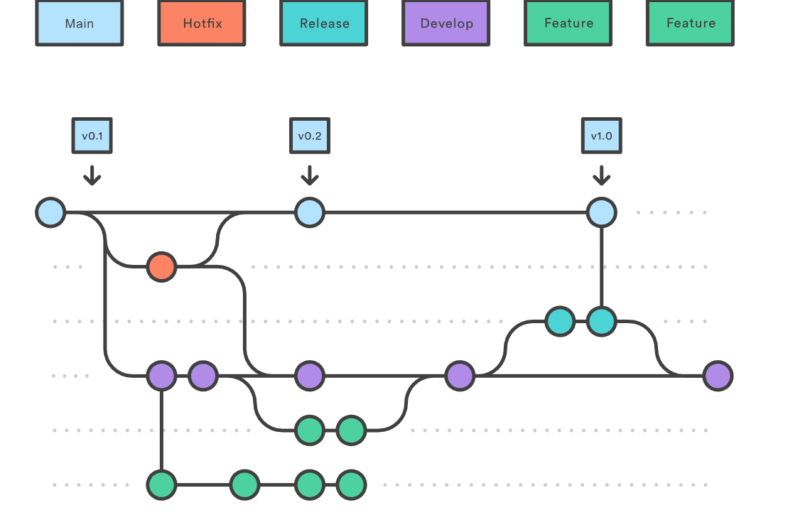

Sau mỗi tuần, team sẽ merge `develop` vào `master` để release phiên bản mới.


## 2. Giới Thiệu Dự Án
- **Tên dự án** : Rustica-Days
- **Giới thiệu** : Trong nhịp sống hiện đại đầy hối hả, chắc hẳn ai trong chúng ta cũng từng ít nhất một lần mơ về cuộc sống yên bình nơi thôn quê – nơi có tiếng chim hót, gió thổi nhẹ qua những luống rau xanh mướt, và bạn thong dong chăm sóc ao cá của riêng mình. Thế nhưng, khi giấc mơ ấy vừa nhen nhóm thì hiện thực lại kéo ta trở về với hàng tá deadline, bảng tính, báo cáo và những ngày “bán mình cho tư bản” không lối thoát. Thấu hiểu những nỗi niềm đó, RusticaDays ra đời như một “nông trại tinh thần” giúp bạn tạm rời xa phố thị ồn ào, trở về với thiên nhiên qua từng cú click chuột. Tại đây, bạn sẽ được bắt đầu lại từ một mảnh đất nhỏ, tự tay gieo hạt, nuôi gà, thả cá và chứng kiến trang trại của mình dần lớn lên từng ngày. Không cần dậy sớm, không lo nắng gió, RusticaDays mang đến cho bạn trải nghiệm trồng rau, nuôi cá và sống chậm giữa thế giới ảo đầy thư giãn. Đây không chỉ là một trò chơi, mà còn là nơi giúp bạn tìm lại cảm giác bình yên giản dị mà cuộc sống hiện đại đôi khi vô tình đánh mất.

- **Thể loại** : 2D, Farming Simulator
- **Mục đích** : giúp người chơi giải tỏa căng thẳng, tăng cường khả năng kinh doanh thông qua việc buôn bán và trao đổi vật phẩm
- **Lối chơi** : Trồng trọt, thu hoạch, giao dịch buôn bán thông qua NPC

## 3. Các Chức Năng Chính

- **Nông nghiệp**: Trồng cây, thu hoạch cây
- **Ngư nghiệp**: Câu cá, bắt cá
- **Hệ thống vật phẩm**: lúa mì, dâu tây,....
- **Hệ thống giao dịch**: mua bán với NPC
- **Hệ thống túi đồ**
- **Chức năng kéo thả vật phẩm**
- **Quản lý nhân vật với thanh năng lượng và tiền xu kiếm được**

## 4. Công nghệ

### 4.1. Công Nghệ Sử Dụng
- Java             - Ngôn ngữ lập trình
- LibGDX           - Framework phát triển game 2D
- Scene2D UI       - Tạo giao diện người dùng
- Tiled Map Editor - Thiết kế bản đồ game
- Gradle           - Quản lý build và dependencies
- Aseprite         - Công cụ tạo assets

### 4.2 Cấu trúc dự án

```
game/
├── GameLauncher.java
├── GameState.java
├── GameWrapper.java
├── MainApplication.java
├── MainMenuScreen.java
├── PlantState.java
├── TutorialScreen.java
├── camera
│   └── GameCamera.java
├── entities
│   ├── GameObject.java
│   ├── NPC.java
│   ├── Player.java
│   ├── animals
│   │   └── FishType.java
│   ├── animations
│   │   ├── LevelUpEffect.java
│   │   ├── PlayerAnimationManager.java
│   │   └── WateringEffect.java
│   └── plants
│       ├── PlantManager.java
│       ├── base
│       │   ├── FarmField.java
│       │   └── Plant.java
│       ├── states
│       │   └── GrowthState.java
│       └── types
│           ├── Carrot.java
│           ├── Corn.java
│           ├── Eggplant.java
│           ├── Garlic.java
│           ├── Pumpkin.java
│           ├── Radish.java
│           ├── Rice.java
│           └── Tomato.java
├── input
│   ├── CollisionHandler.java
│   └── PlayerInputHandler.java
├── inventory
│   ├── DragAndDropHandler.java
│   ├── InventoryItemState.java
│   ├── InventoryManager.java
│   └── InventorySlot.java
├── items
│   ├── animalproducts
│   │   └── FishItem.java
│   ├── base
│   │   ├── Item.java
│   │   └── ItemFactory.java
│   ├── crops
│   │   ├── Carrot.java
│   │   ├── Corn.java
│   │   ├── Eggplant.java
│   │   ├── Garlic.java
│   │   ├── Harvest.java
│   │   ├── Pumpkin.java
│   │   ├── Radish.java
│   │   ├── Rice.java
│   │   └── Tomato.java
│   ├── seeds
│   │   ├── CarrotSeed.java
│   │   ├── CornSeed.java
│   │   ├── EggplantSeed.java
│   │   ├── GarlicSeed.java
│   │   ├── PumpkinSeed.java
│   │   ├── RadishSeed.java
│   │   ├── RiceSeed.java
│   │   ├── Seed.java
│   │   └── TomatoSeed.java
│   └── tools
│       ├── FishingRod.java
│       ├── Sickle.java
│       ├── Tool.java
│       └── WateringCan.java
├── module
│   └── SleepSystem.java
├── render
│   ├── MapRenderer.java
│   └── RenderManager.java
├── sound
│   └── SoundManager.java
└── ui
    ├── InventoryUI.java
    ├── NPCInteractionMenu.java
    ├── SellUI.java
    ├── ShopUI.java
    └── StatsBar.java
```

Diễn giải:
- **GameState**: Lấy tất cả thông tin của các đối tượng để lưu game
- **GameLauncher**: Chạy game
- **GameWrapper**: Chuyển gameLauncher sang dạng screen
- **MainApplication**: thành phần app chính
- **MainMenuScreen**: thành phần hiển thị menu
- **TutorialScreen**: thành phần hiển thị hướng dẫn game
- **camera**: được dùng để set góc nhìn đi theo nhân vật
- **entities**: Các thực thể trong game (nhân vật, cây trồng,...)
- **input**: xử lý đầu vào
- **inventory**: túi đồ
- **items**: vật phẩm
- **module**: xử lý đi ngủ
- **render**: dùng để render map
- **sound**: Âm thanh
- **ui**: chứa các giao diện


## 5. Ảnh và Video Demo

**Ảnh Demo:**
- **Màn hình khởi động**:
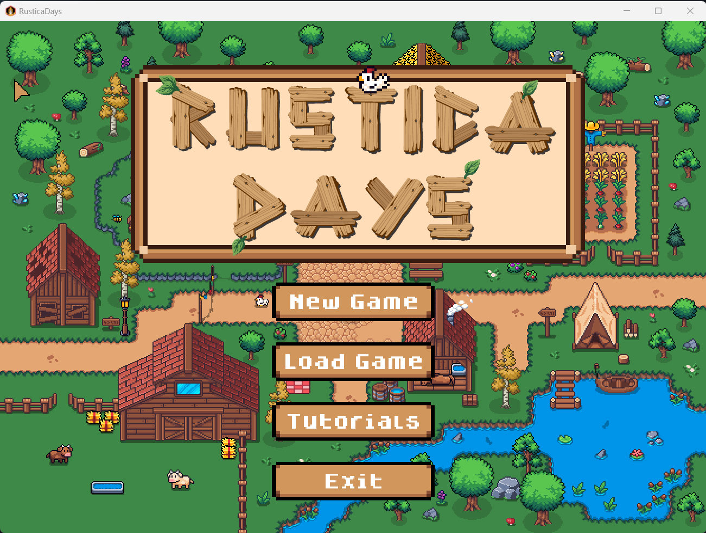

- **Hướng dẫn game**:
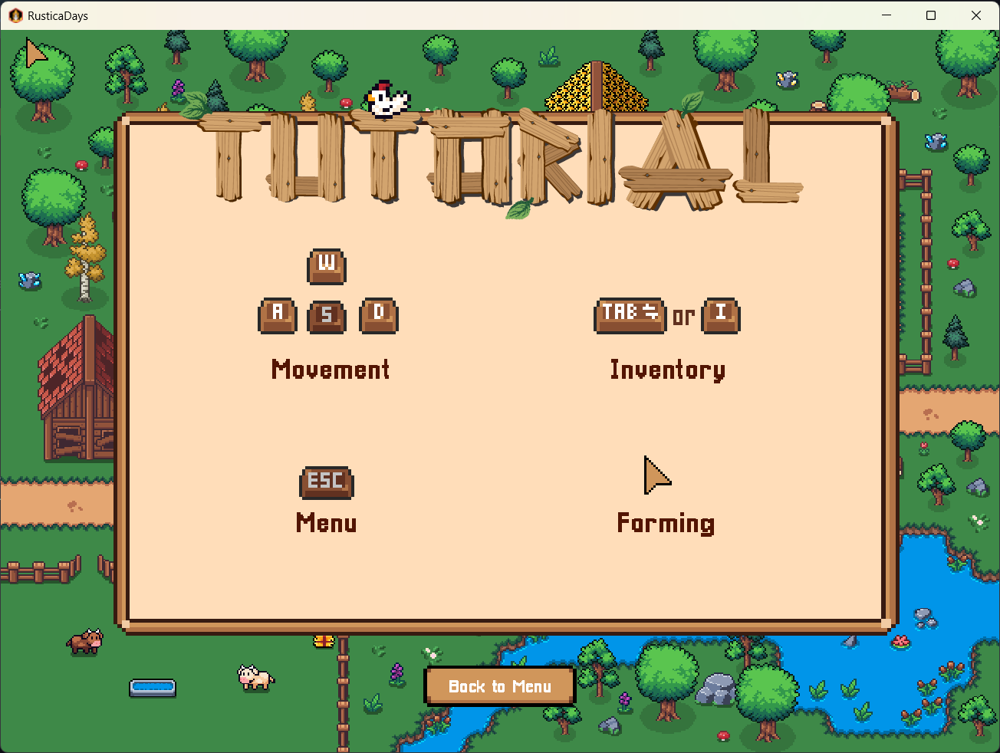

- **Game chính**:
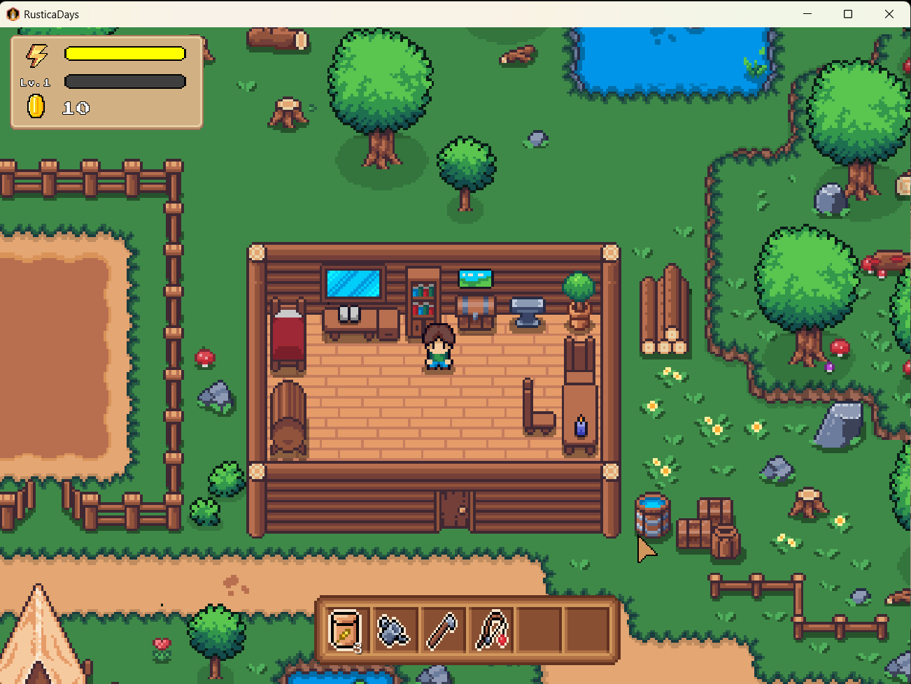

- **Câu cá**:
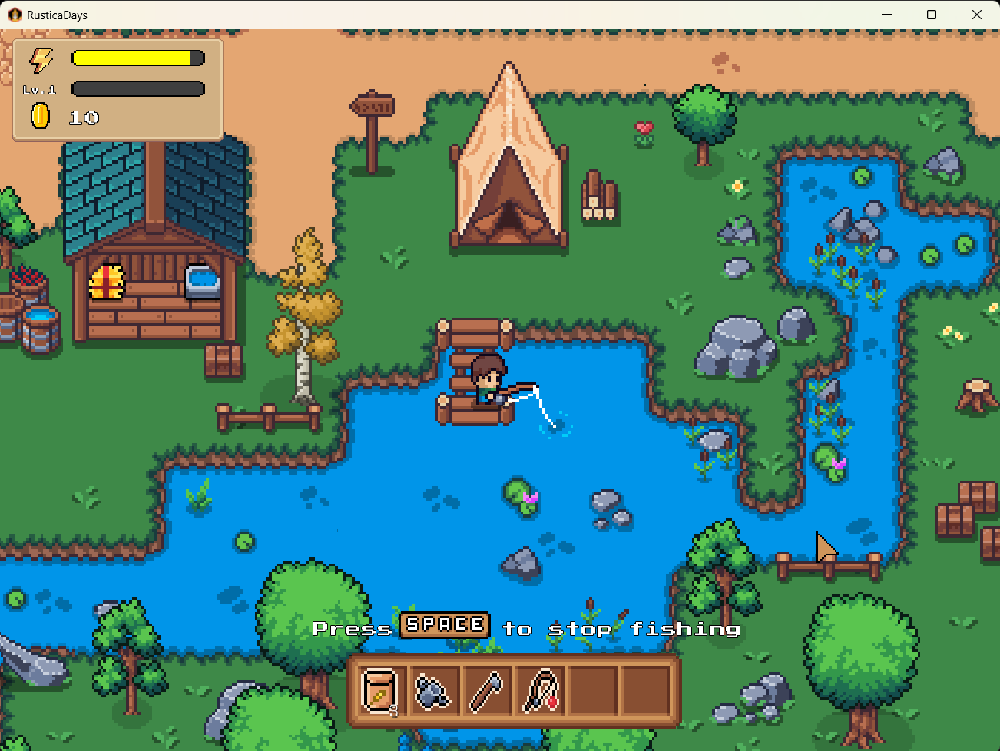

- **Trồng cây**:
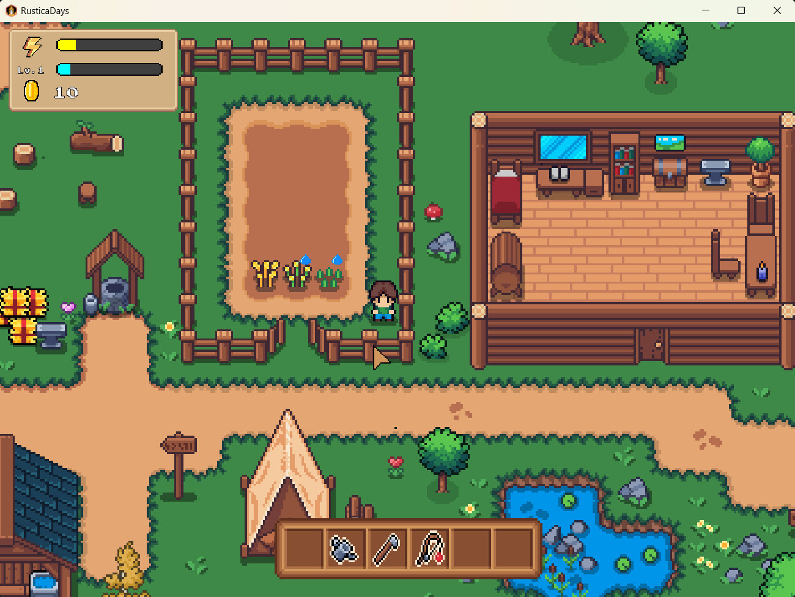

- **NPC giao dịch**:
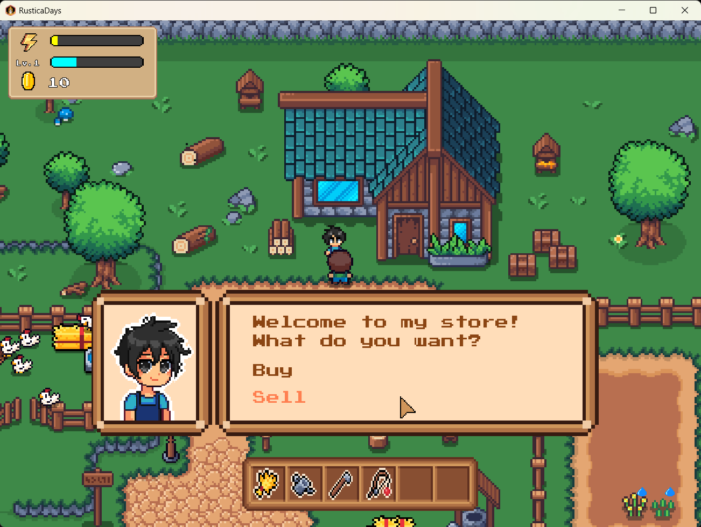

- **Shop mua**:
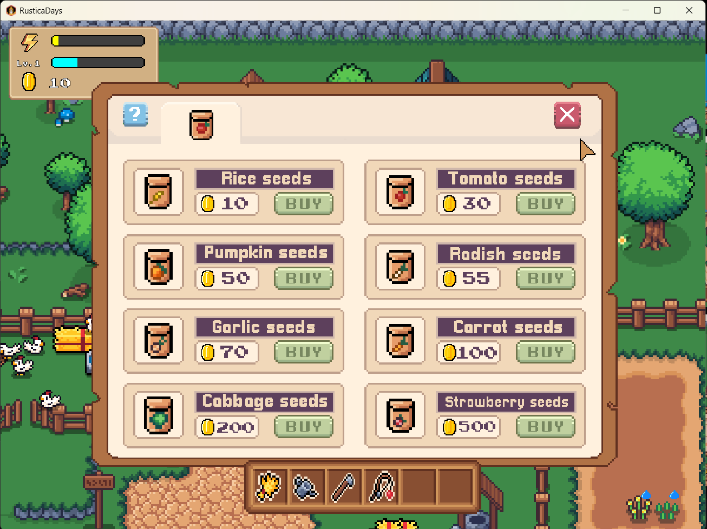

- **Shop bán**:
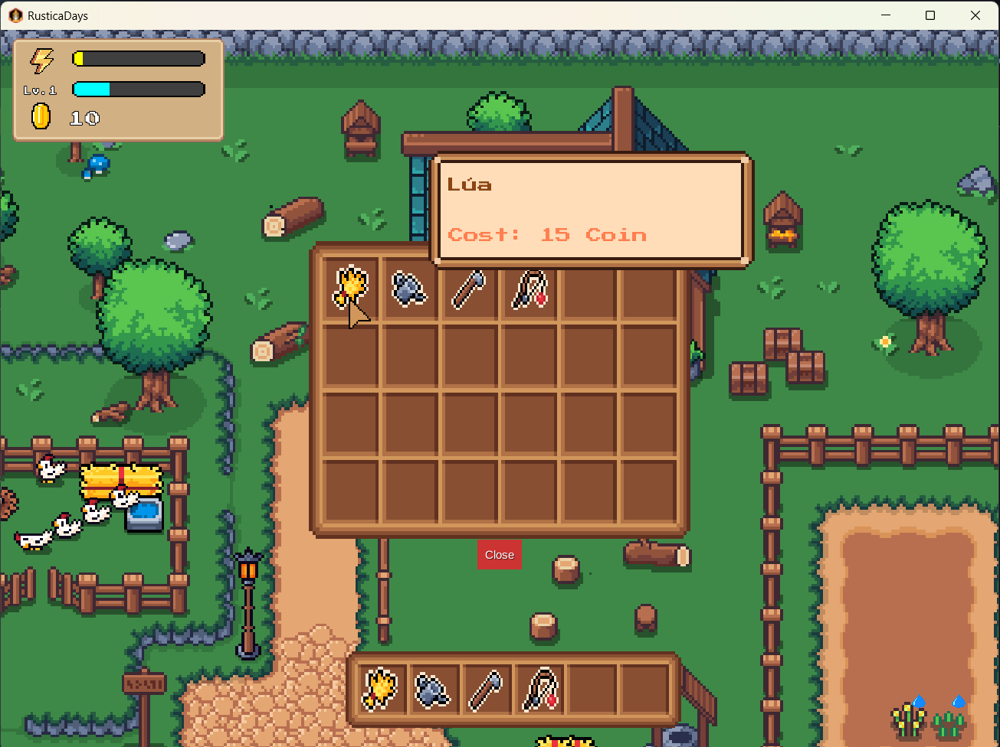

- **Thăm gà, bò**:
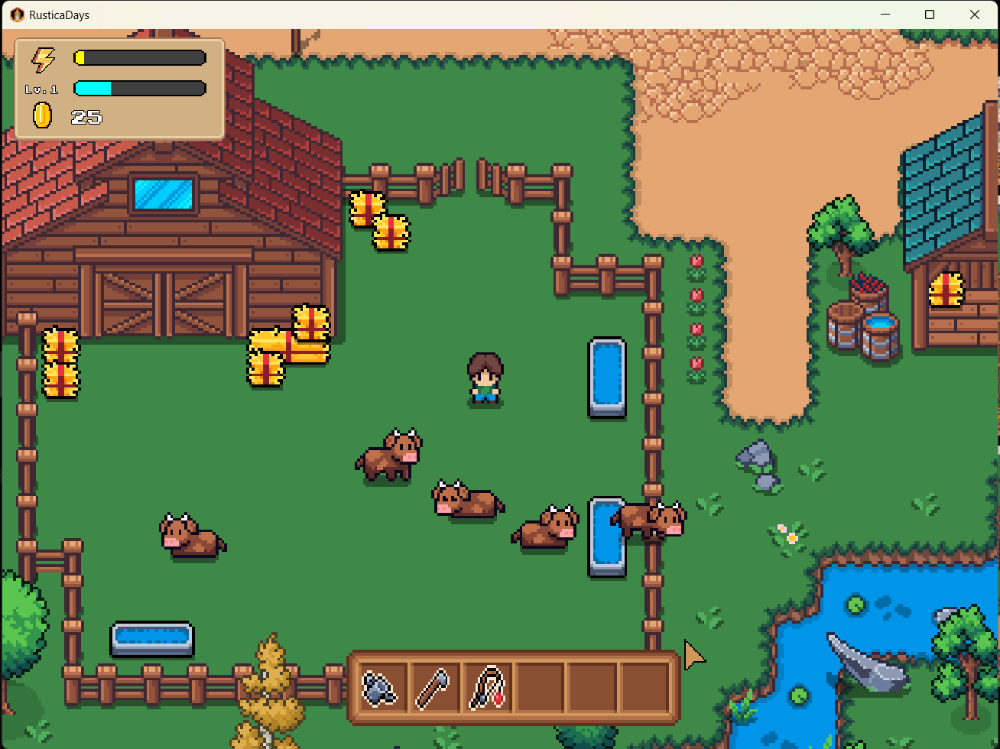

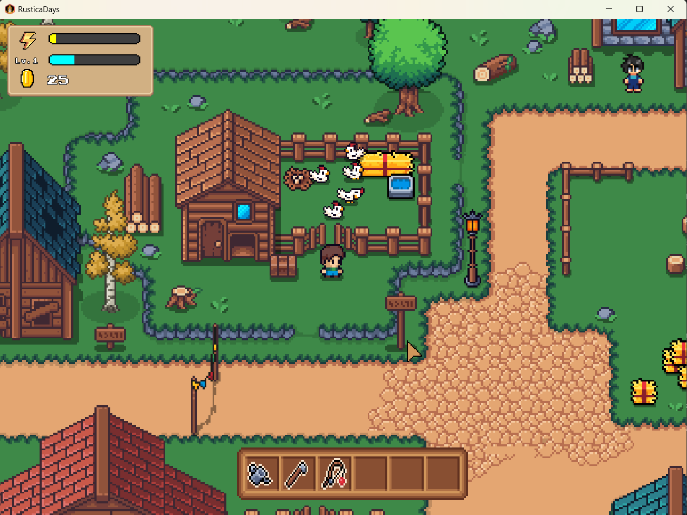

- **Level Up**:
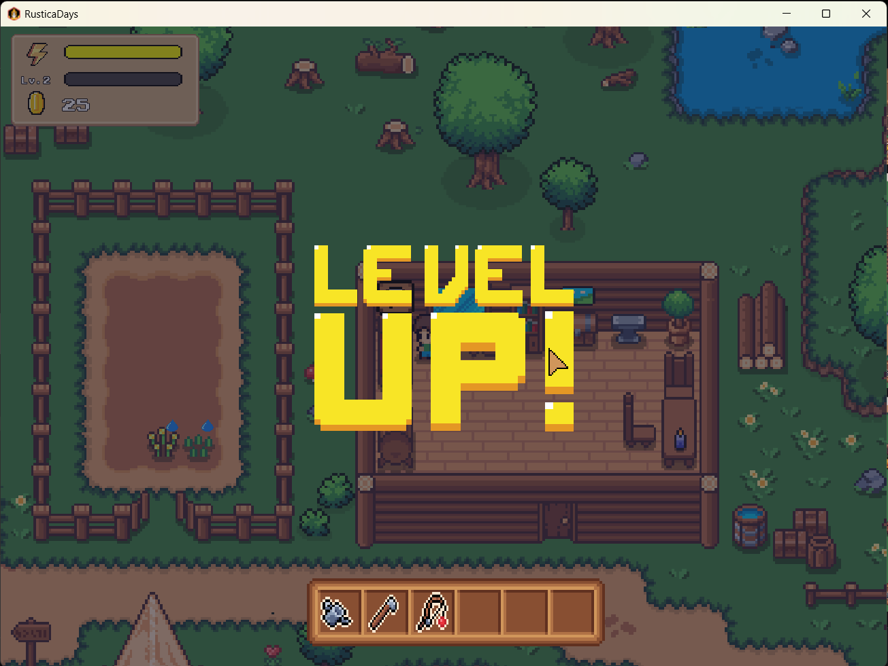
- 
**Video Demo:**
[https://youtu.be/BNbX3OFQkUY](#)


## 6. Các Vấn Đề Gặp Phải

### Vấn Đề 1: 
- **Vẽ map**: các layer trong map, set chướng ngại vật 

### Hành Động Để Giải Quyết

**Giải pháp:** sắp xếp các Object theo trục Y
### Kết Quả

- Các layer hiển thị 1 cách hợp lý, và được sắp xếp tọa độ theo nhân vật

### Vấn Đề 2: 
- Xử lý các assets chuyển động, việc cut ảnh và logic chạy frame chưa thống nhất


### Hành Động Để Giải Quyết

**Giải pháp:** Phải cut ảnh, đo đạc chính xác các kích thước và sử dụng logic thống nhất

### Kết Quả

- Nhân vật và các hành động như đi bộ, câu cá,... có thể chuyển động mượt mà; động vật như bò, gà cũng có thể chuyển động mượt mà tương tự 

## 7. Kết Luận

**Kết quả đạt được:** Game có thể chạy mượt mà, các chuyển động không còn bị khựng hay còn lỗi logic trong di chuyển nữa; các hoạt động được kết hợp hài hòa với âm thanh như trồng cây sẽ có tiếng trồng cây, hoặc khi lên level cũng sẽ có âm thanh riêng.

**Hướng phát triển tiếp theo:** Có thể tạo server cho nhiều người chơi, có thể tạo ra nhiều vật phẩm hơn nữa từ những vật phẩm sẵn có, khai thác khoáng sản, đánh quái,...
